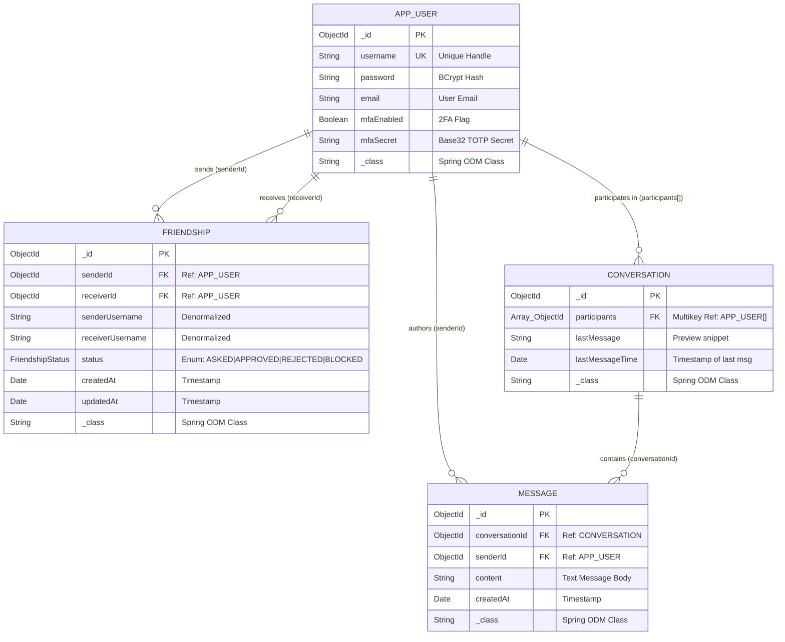

# Database Schema & Entity Relationship Diagram (ERD) Specification

> **Project**: `JwtAuth` (Spring Boot 3 + Spring Data MongoDB)  
> **Database Engine**: MongoDB (Document Store)  
> **Database Name**: `jwtauth`  
> **Document ODM**: Spring Data MongoDB (`@Document`, `@Indexed`, `@CompoundIndex`, `@Id`)  
> **Document Purpose**: Definitive database reference, schema breakdown, ERD visualization, and interview study guide for resume preparation.

---

## 1. High-Level Database Overview

The `JwtAuth` system uses **MongoDB** as its primary data store. The database consists of 4 main collections designed to support multi-factor authentication (MFA/2FA), bidirectional friendship workflows, and real-time/persistent direct messaging between users.

### Collection Summary
| Collection Name | Spring Entity Class | Primary Responsibility | Primary Key Type |
| :--- | :--- | :--- | :--- |
| **`app-user`** | [`User.java`](file:///d:/DDU_Study/MISSION_MASTERCARD/jwtauth/src/main/java/com/mk/jwtauth/entity/User.java) | User credentials, email, Spring Security authorities, TOTP 2FA secret | `ObjectId` (`_id`) |
| **`friendships`** | [`Friendship.java`](file:///d:/DDU_Study/MISSION_MASTERCARD/jwtauth/src/main/java/com/mk/jwtauth/entity/Friendship.java) | Bidirectional social graph relationships and request states | `ObjectId` (`_id`) |
| **`conversations`** | [`Conversation.java`](file:///d:/DDU_Study/MISSION_MASTERCARD/jwtauth/src/main/java/com/mk/jwtauth/entity/Conversation.java) | Chat rooms/dialogs binding participant users together | `ObjectId` (`_id`) |
| **`messages`** | [`Message.java`](file:///d:/DDU_Study/MISSION_MASTERCARD/jwtauth/src/main/java/com/mk/jwtauth/entity/Message.java) | Individual chat messages linked to a parent conversation | `ObjectId` (`_id`) |

---

## 2. Complete Architecture Mapping (Entity ↔ Repository ↔ Service ↔ Controller)

Use this quick-reference matrix to trace request flow from HTTP endpoints down to MongoDB collections:

```
[ HTTP Request ] ──► [ Controller ] ──► [ Service Layer ] ──► [ Repository ] ──► [ Mongo Entity ] ──► [ MongoDB Collection ]
```

### Module-by-Module Mapping Table

| Feature Domain | MongoDB Collection | Entity Class | Repository Interface | Key Repository Methods | Connected Service(s) | Connected Controller(s) |
| :--- | :--- | :--- | :--- | :--- | :--- | :--- |
| **User & Authentication** | `app-user` | [`User.java`](file:///d:/DDU_Study/MISSION_MASTERCARD/jwtauth/src/main/java/com/mk/jwtauth/entity/User.java) | [`UserRepository.java`](file:///d:/DDU_Study/MISSION_MASTERCARD/jwtauth/src/main/java/com/mk/jwtauth/repository/UserRepository.java) | • `findByUsername(username)` | [`AuthService.java`](file:///d:/DDU_Study/MISSION_MASTERCARD/jwtauth/src/main/java/com/mk/jwtauth/service/AuthService.java)<br>[`MfaService.java`](file:///d:/DDU_Study/MISSION_MASTERCARD/jwtauth/src/main/java/com/mk/jwtauth/service/MfaService.java)<br>[`UserService.java`](file:///d:/DDU_Study/MISSION_MASTERCARD/jwtauth/src/main/java/com/mk/jwtauth/service/UserService.java) | [`AuthController.java`](file:///d:/DDU_Study/MISSION_MASTERCARD/jwtauth/src/main/java/com/mk/jwtauth/controller/AuthController.java)<br>[`MfaController.java`](file:///d:/DDU_Study/MISSION_MASTERCARD/jwtauth/src/main/java/com/mk/jwtauth/controller/MfaController.java) |
| **Social Graph & Friendships** | `friendships` | [`Friendship.java`](file:///d:/DDU_Study/MISSION_MASTERCARD/jwtauth/src/main/java/com/mk/jwtauth/entity/Friendship.java) | [`FriendshipRepository.java`](file:///d:/DDU_Study/MISSION_MASTERCARD/jwtauth/src/main/java/com/mk/jwtauth/repository/FriendshipRepository.java) | • `findBySenderIdAndReceiverId(...)`<br>• `findByReceiverIdAndStatus(...)`<br>• `findBySenderIdOrReceiverId(...)`<br>• `findBySenderId(...)` | [`FriendshipService.java`](file:///d:/DDU_Study/MISSION_MASTERCARD/jwtauth/src/main/java/com/mk/jwtauth/service/FriendshipService.java) | [`FriendshipController.java`](file:///d:/DDU_Study/MISSION_MASTERCARD/jwtauth/src/main/java/com/mk/jwtauth/controller/FriendshipController.java) |
| **Conversations / Dialogs** | `conversations` | [`Conversation.java`](file:///d:/DDU_Study/MISSION_MASTERCARD/jwtauth/src/main/java/com/mk/jwtauth/entity/Conversation.java) | [`ConversationRepository.java`](file:///d:/DDU_Study/MISSION_MASTERCARD/jwtauth/src/main/java/com/mk/jwtauth/repository/ConversationRepository.java) | • `findByParticipantsContainingAndParticipantsContaining(...)`<br>• `findByParticipantsContaining(...)` | [`MessagingService.java`](file:///d:/DDU_Study/MISSION_MASTERCARD/jwtauth/src/main/java/com/mk/jwtauth/messaging/MessagingService.java) | [`MessagingController.java`](file:///d:/DDU_Study/MISSION_MASTERCARD/jwtauth/src/main/java/com/mk/jwtauth/messaging/MessagingController.java) |
| **Direct Messages** | `messages` | [`Message.java`](file:///d:/DDU_Study/MISSION_MASTERCARD/jwtauth/src/main/java/com/mk/jwtauth/entity/Message.java) | [`MessageRepository.java`](file:///d:/DDU_Study/MISSION_MASTERCARD/jwtauth/src/main/java/com/mk/jwtauth/repository/MessageRepository.java) | • `findByConversationIdOrderByCreatedAtDesc(...)` | [`MessagingService.java`](file:///d:/DDU_Study/MISSION_MASTERCARD/jwtauth/src/main/java/com/mk/jwtauth/messaging/MessagingService.java) | [`MessagingController.java`](file:///d:/DDU_Study/MISSION_MASTERCARD/jwtauth/src/main/java/com/mk/jwtauth/messaging/MessagingController.java) |

---

## 3. Entity Relationship Diagram (ERD)



---

## 4. Detailed Collection Schemas

### A. `app-user` Collection
* **Mapped Entity**: [`com.mk.jwtauth.entity.User`](file:///d:/DDU_Study/MISSION_MASTERCARD/jwtauth/src/main/java/com/mk/jwtauth/entity/User.java)
* **Connected Repository**: [`com.mk.jwtauth.repository.UserRepository`](file:///d:/DDU_Study/MISSION_MASTERCARD/jwtauth/src/main/java/com/mk/jwtauth/repository/UserRepository.java)
* **Description**: Stores core user identity, credentials, and 2FA configuration. Implements Spring Security's `UserDetails`.

#### Field Definitions
| Field Name | BSON / Java Type | Index / Constraints | Description | Example Live Value |
| :--- | :--- | :--- | :--- | :--- |
| `_id` | `ObjectId` | Primary Key (`_id_`) | System-generated unique identifier | `ObjectId("6a6e4c19ad1b2064db5ccc3d")` |
| `username` | `String` | `@Indexed(unique = true)` | Unique user login handle | `"mohit123"` |
| `password` | `String` | Non-null | BCrypt password hash (`$2a$10$...`) | `"$2a$10$cA7z/WpshXn..."` |
| `email` | `String` | Optional | User email address | `"makavanamohi777@gmail.com"` |
| `mfaEnabled`| `Boolean` | Default: `false` | Enables 2FA / TOTP challenge on login | `true` |
| `mfaSecret` | `String` | Nullable | Base32 TOTP secret key for Google Authenticator | `"O73R2CYQFV2K5ZAW4UNEGI4QMHTLU6MJ"` |
| `_class` | `String` | Metadata | Spring Data MongoDB polymorphic discriminator | `"com.mk.jwtauth.entity.User"` |

#### Index Specifications
```json
{
  "_id_": { "key": [["_id", 1]] },
  "username": { "key": [["username", 1]], "unique": true }
}
```

#### Sample Document (Live Database)
```json
{
  "_id": { "$oid": "6a6e4c19ad1b2064db5ccc3d" },
  "username": "mohit123",
  "password": "$2a$10$cA7z/WpshXnkeMG1qJ7LcOmWQ8rZtmRISdIuH6f/KlvfUA2.HJAni",
  "email": "makavanamohi777@gmail.com",
  "mfaEnabled": true,
  "mfaSecret": "O73R2CYQFV2K5ZAW4UNEGI4QMHTLU6MJ",
  "_class": "com.mk.jwtauth.entity.User"
}
```

---

### B. `friendships` Collection
* **Mapped Entity**: [`com.mk.jwtauth.entity.Friendship`](file:///d:/DDU_Study/MISSION_MASTERCARD/jwtauth/src/main/java/com/mk/jwtauth/entity/Friendship.java)
* **Connected Repository**: [`com.mk.jwtauth.repository.FriendshipRepository`](file:///d:/DDU_Study/MISSION_MASTERCARD/jwtauth/src/main/java/com/mk/jwtauth/repository/FriendshipRepository.java)
* **Description**: Tracks bidirectional friendship state transitions between pairs of users.

#### Field Definitions
| Field Name | BSON / Java Type | Index / Constraints | Description | Example Live Value |
| :--- | :--- | :--- | :--- | :--- |
| `_id` | `ObjectId` | Primary Key (`_id_`) | System-generated identifier | `ObjectId("6a6e4c4fad1b2064db5ccc3f")` |
| `senderId` | `ObjectId` | Compound FK (`user_pair_idx`) | User ID initiating request | `ObjectId("6a6e4c42ad1b2064db5ccc3e")` |
| `receiverId` | `ObjectId` | Compound FK (`user_pair_idx`) | User ID targeted by request | `ObjectId("6a6e4c19ad1b2064db5ccc3d")` |
| `senderUsername` | `String` | Denormalized Field | Sender handle (avoids join lookup) | `"mohit777"` |
| `receiverUsername` | `String` | Denormalized Field | Receiver handle (avoids join lookup) | `"mohit123"` |
| `status` | `String` (Enum) | Non-null | State: `ASKED`, `APPROVED`, `REJECTED`, `BLOCKED` | `"APPROVED"` |
| `createdAt` | `Date` (`ISO-8601`) | Timestamp | Timestamp of request creation | `"2026-08-01T19:43:11.023Z"` |
| `updatedAt` | `Date` (`ISO-8601`) | Timestamp | Timestamp of last status change | `"2026-08-01T19:43:33.355Z"` |
| `_class` | `String` | Metadata | Spring Data MongoDB discriminator | `"com.mk.jwtauth.entity.Friendship"` |

#### Index Specifications
* **Compound Unique Index (`user_pair_idx`)**: Guarantees at database level that only one friendship relationship record can exist for any `(senderId, receiverId)` pair.
```json
{
  "_id_": { "key": [["_id", 1]] },
  "user_pair_idx": { "key": [["senderId", 1], ["receiverId", 1]], "unique": true }
}
```

#### Sample Document (Live Database)
```json
{
  "_id": { "$oid": "6a6e4c4fad1b2064db5ccc3f" },
  "senderId": { "$oid": "6a6e4c42ad1b2064db5ccc3e" },
  "receiverId": { "$oid": "6a6e4c19ad1b2064db5ccc3d" },
  "senderUsername": "mohit777",
  "receiverUsername": "mohit123",
  "status": "APPROVED",
  "createdAt": { "$date": "2026-08-01T19:43:11.023Z" },
  "updatedAt": { "$date": "2026-08-01T19:43:33.355Z" },
  "_class": "com.mk.jwtauth.entity.Friendship"
}
```

---

### C. `conversations` Collection
* **Mapped Entity**: [`com.mk.jwtauth.entity.Conversation`](file:///d:/DDU_Study/MISSION_MASTERCARD/jwtauth/src/main/java/com/mk/jwtauth/entity/Conversation.java)
* **Connected Repository**: [`com.mk.jwtauth.repository.ConversationRepository`](file:///d:/DDU_Study/MISSION_MASTERCARD/jwtauth/src/main/java/com/mk/jwtauth/repository/ConversationRepository.java)
* **Description**: Represents a chat dialog between participant users. Maintains the latest message metadata for quick conversation feed listings.

#### Field Definitions
| Field Name | BSON / Java Type | Index / Constraints | Description | Example Live Value |
| :--- | :--- | :--- | :--- | :--- |
| `_id` | `ObjectId` | Primary Key (`_id_`) | Conversation ID | `ObjectId("6a6e4c76ad1b2064db5ccc40")` |
| `participants` | `Array<ObjectId>` | `@Indexed` (Multikey Index) | List of participant `User._id`s | `[ObjectId("...3d"), ObjectId("...3e")]` |
| `lastMessage` | `String` | Preview content | Snippet of the most recent message | `"hello i am also doing fine here"` |
| `lastMessageTime`| `Date` (`ISO-8601`) | Timestamp | Date/Time of the most recent message | `"2026-08-05T10:58:44.443Z"` |
| `_class` | `String` | Metadata | Spring Data MongoDB discriminator | `"com.mk.jwtauth.entity.Conversation"` |

#### Index Specifications
* **Multikey Index (`participants`)**: MongoDB automatically indexes each array element in `participants`. Enables fast matching using `$all` or `$in` operators.
```json
{
  "_id_": { "key": [["_id", 1]] },
  "participants": { "key": [["participants", 1]] }
}
```

#### Sample Document (Live Database)
```json
{
  "_id": { "$oid": "6a6e4c76ad1b2064db5ccc40" },
  "participants": [
    { "$oid": "6a6e4c19ad1b2064db5ccc3d" },
    { "$oid": "6a6e4c42ad1b2064db5ccc3e" }
  ],
  "lastMessage": "hello i am also doing fine here",
  "lastMessageTime": { "$date": "2026-08-05T10:58:44.443Z" },
  "_class": "com.mk.jwtauth.entity.Conversation"
}
```

---

### D. `messages` Collection
* **Mapped Entity**: [`com.mk.jwtauth.entity.Message`](file:///d:/DDU_Study/MISSION_MASTERCARD/jwtauth/src/main/java/com/mk/jwtauth/entity/Message.java)
* **Connected Repository**: [`com.mk.jwtauth.repository.MessageRepository`](file:///d:/DDU_Study/MISSION_MASTERCARD/jwtauth/src/main/java/com/mk/jwtauth/repository/MessageRepository.java)
* **Description**: Holds individual chat message records sent within a conversation.

#### Field Definitions
| Field Name | BSON / Java Type | Index / Constraints | Description | Example Live Value |
| :--- | :--- | :--- | :--- | :--- |
| `_id` | `ObjectId` | Primary Key (`_id_`) | Unique message identifier | `ObjectId("6a6e4c76ad1b2064db5ccc41")` |
| `conversationId` | `ObjectId` | `@Indexed` FK | Reference to parent `Conversation._id` | `ObjectId("6a6e4c76ad1b2064db5ccc40")` |
| `senderId` | `ObjectId` | Foreign Key | Reference to author `User._id` | `ObjectId("6a6e4c19ad1b2064db5ccc3d")` |
| `content` | `String` | Non-null | Text payload of the message | `"hello mohit what are you doing ??"` |
| `createdAt` | `Date` (`ISO-8601`) | Timestamp | Timestamp when message was dispatched | `"2026-08-01T19:43:50.609Z"` |
| `_class` | `String` | Metadata | Spring Data MongoDB discriminator | `"com.mk.jwtauth.entity.Message"` |

#### Index Specifications
```json
{
  "_id_": { "key": [["_id", 1]] },
  "conversationId": { "key": [["conversationId", 1]] }
}
```

#### Sample Document (Live Database)
```json
{
  "_id": { "$oid": "6a6e4c76ad1b2064db5ccc41" },
  "conversationId": { "$oid": "6a6e4c76ad1b2064db5ccc40" },
  "senderId": { "$oid": "6a6e4c19ad1b2064db5ccc3d" },
  "content": "hello mohit what are you doing ??",
  "createdAt": { "$date": "2026-08-01T19:43:50.609Z" },
  "_class": "com.mk.jwtauth.entity.Message"
}
```

---

## 5. Query & Index Mapping Matrix

This matrix demonstrates how Spring Data repository queries in Java directly leverage MongoDB indexes for optimal performance (`O(log N)` index lookup instead of `O(N)` collection scan):

| Spring Data Repository Method | Target Collection | MongoDB Query Execution | Index Used |
| :--- | :--- | :--- | :--- |
| `findByUsername(String username)` | `app-user` | `db['app-user'].find({ username: "..." })` | Unique Index on `username` |
| `findBySenderIdAndReceiverId(sId, rId)` | `friendships` | `db.friendships.find({ senderId: sId, receiverId: rId })` | Compound Index `user_pair_idx` |
| `findByReceiverIdAndStatus(rId, status)` | `friendships` | `db.friendships.find({ receiverId: rId, status: "..." })` | Single Field / Scanned |
| `findByParticipantsContaining(userId)` | `conversations` | `db.conversations.find({ participants: userId })` | Multikey Index on `participants` |
| `findByParticipantsContainingAnd...` | `conversations` | `db.conversations.find({ participants: { $all: [u1, u2] } })` | Multikey Index on `participants` |
| `findByConversationIdOrderByCreatedAtDesc` | `messages` | `db.messages.find({ conversationId: cId }).sort({ createdAt: -1 })` | Single Field Index on `conversationId` |

---

## 6. Architectural Design Decisions & Interview Q&A (Resume Prep)

### Q1: Why did you choose MongoDB (NoSQL) over a Relational Database (SQL) for this project?
> **Answer**:
> 1. **Flexible & Evolving Schema**: Chat systems and user profiles frequently undergo schema iterations (e.g. adding MFA fields, conversation metadata, or future media attachments). MongoDB's document model allows seamless schema changes without expensive SQL `ALTER TABLE` locks.
> 2. **Native JSON/BSON Alignment**: Modern RESTful APIs and Spring Data MongoDB handle Java objects to BSON/JSON transformations natively without complex ORM mapping overhead (no Hibernate `LazyInitializationException` or N+1 select pitfalls).
> 3. **High Write Throughput**: Chat messaging produces high write volumes. MongoDB's append-oriented write model and single-document atomicity provide excellent performance for write-intensive chat workloads.

---

### Q2: How do you handle entity relationships in MongoDB since NoSQL databases do not enforce Foreign Keys?
> **Answer**:
> In MongoDB, entity relationships are handled using **Manual References** (`ObjectId` fields) or **Embedding**:
> - **Manual Reference Pattern**: `Message.conversationId` stores the `ObjectId` of a document in `conversations`. The application layer resolves relations via query chaining or application-level joins.
> - **Multikey Array Reference**: `Conversation.participants` stores an array of `User._id`s `[ObjectId, ObjectId]`. MongoDB's multikey index allows efficient querying of array elements using `$all` or `$in`.
> - **Application-Enforced Integrity**: Referential integrity is enforced at the Service layer (e.g. `MessagingService` verifies that an approved friendship exists before inserting a message).

---

### Q3: Why didn't you embed `Message` documents inside the `Conversation` document?
> **Answer**:
> Embedding array items inside a parent document is anti-pattern when array growth is unbounded.
> 1. **MongoDB 16MB Document Limit**: A single BSON document in MongoDB cannot exceed 16 megabytes. A long active chat room would eventually breach this limit if all messages were stored inside a single conversation document.
> 2. **Performance & Memory**: Fetching a conversation list (`GET /messages/conversations`) would load megabytes of historical message data into RAM unnecessarily.
> 3. **Pagination**: Storing messages in a separate `messages` collection indexed by `conversationId` allows efficient pagination (`orderByCreatedAtDesc`) and streaming.
> 
> *Design Note*: We **denormalized** `lastMessage` and `lastMessageTime` inside `Conversation` so the conversation list UI renders instantly without querying the `messages` collection.

---

### Q4: Why did you denormalize `senderUsername` and `receiverUsername` in the `friendships` collection?
> **Answer**:
> **Read Optimization vs Write Frequency**:
> In a social app, user profile handles change rarely, but friend list pages (`GET /friends/list`, `GET /friends/requests`) are loaded constantly.
> Without denormalization, fetching a user's friend list would require performing a `$lookup` aggregation join or $N$ database calls to `app-user` to resolve usernames from `ObjectId`s. By storing `senderUsername` and `receiverUsername` directly in `Friendship`, we can fulfill friend list queries in a single indexed query.

---

### Q5: How do you prevent duplicate friend requests between the same two users at the database level?
> **Answer**:
> We enforce a **Compound Unique Index** on `(senderId, receiverId)` in the `friendships` collection using Spring Data's `@CompoundIndex`:
> ```java
> @CompoundIndex(
>     name = "user_pair_idx",
>     def = "{'senderId': 1, 'receiverId': 1}",
>     unique = true
> )
> ```
> If a user attempts to send a duplicate request, MongoDB throws a `DuplicateKeyException` (`E11000 duplicate key error`), which `GlobalExceptionHandler` converts into a clean HTTP 409 Conflict error.

---

### Q6: How is Multi-Factor Authentication (MFA / 2FA) supported in the schema?
> **Answer**:
> In the `app-user` collection:
> - `mfaEnabled` (`Boolean`): Flag indicating if TOTP 2FA is active.
> - `mfaSecret` (`String`): Base32-encoded TOTP secret string.
> - During login (`/auth/login`), if `mfaEnabled == true`, the service returns a short-lived `TOKEN_TEMPORARY` (5-minute expiration) restricting API access solely to `/mfa/verify`. Once the user presents the matching 6-digit TOTP code, the token is upgraded to a full `TOKEN_LOGIN`.

---

## 7. Verification & Live Database Metrics

* **Database Connection**: Tested & Verified (`mongodb+srv://.../jwtauth`)
* **Active Collections**:
  * `app-user`: 3 Users registered
  * `friendships`: 2 Friendship records established
  * `conversations`: 2 Active conversation dialogs
  * `messages`: 9 Messages exchanged
